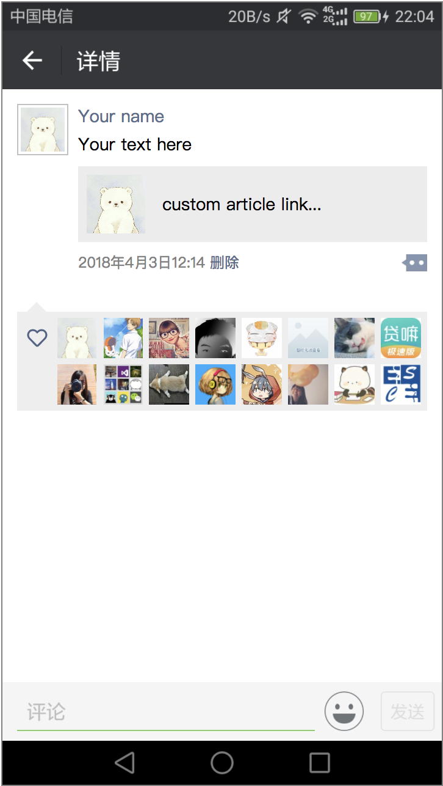

# Wechat Moments

This repository uses HTML5 to mimic Wechat Moments. It could automatically append avatars on the like board.

I design the UI according to Chrome, HUAWEI Honor 5C and Android; however, css is written with variables instead of absolute numbers.

## How to use
You might change the width and height according to your own phone. The base width and height are defined in [index.css](index.css). 
````
body {
    /*min-height: 100vh;*/
    --interface_width: 360px;  /* change according to your own phone */
    --interface_height: 640px; /* change according to your own phone */
    --header_ratio: 214 / 1080;
    --footer_ratio: 251 / 1080;
}
````
All the avatars are stored at **img/avatar**, and your avatar is named as **me.png**.
For your friends' avatars, you might find them in your mobile's Wechat directory, also named as **avatar** (Since it may vary according to mobile phones, just Google it to get the right answer). Run **scripts/convert_avatars.py** and it will convert those avatars into an unified format, like 0001.png into **img/avatar**.

## Example

